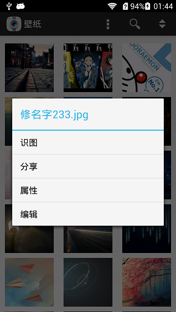
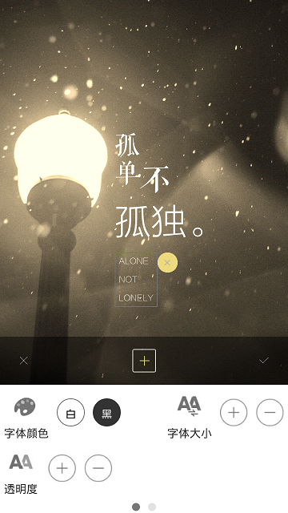

#[Android图库应用](https://github.com/inexistence/PictureLibrary)

##分工

###黄建斌：

* 能以略缩图方式浏览sdcard上的图片和视频 

* 按一定规则分级排序。如按文件夹名称、按创建时间

* 程序性能好，加载快，体验流畅 （此功能点演示需保证手机上视频与图片的文件数总和超过500个）；

* 支持 "编辑" 操作，如给图片加滤镜、加文案；

* 支持 "识图" 操作，如能调用网络上某些视图的api，获取并展示到这张图片的更多信息

###岳臻：

* 对于图片支持查看大图操作

###煜钏

* 对于视频支持播放

* 支持 "添加" 操作，如可在应用里面直接拍照或录像；

###顺忠

* 支持 "更多" 操作，如分享到微信；

* 支持 "搜索" 操作，如搜索关键字 "花" ，过滤出本地所有与花相关的图片，甚至能在网络上拉取到不多于10张与花相关的图片； 

##主要界面预览

###浏览图片视频

###拍照录像

###属性

###分享

###识图

###编辑（滤镜&文案）

###看大图

###看视频

